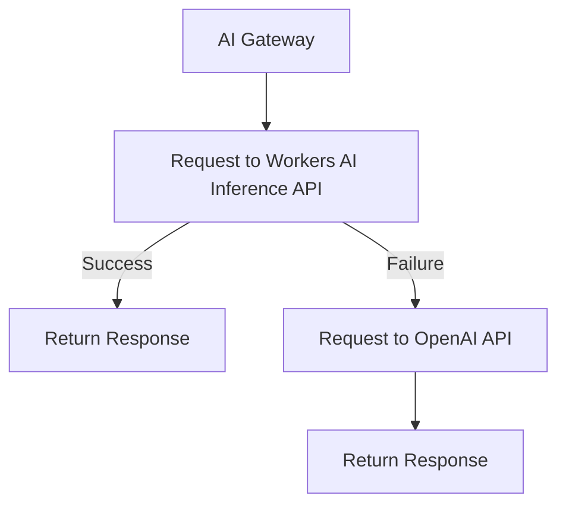

import { Render } from "~/components";

Specify model or provider fallbacks with your [Universal endpoint](/ai-gateway/providers/universal/) to handle request failures and ensure reliability.

Cloudflare can trigger your fallback provider in response to [request errors](#request-failures) or [predetermined request timeouts](#request-timeouts). The [response header `cf-aig-step`](#response-headercf-aig-step) indicates which step successfully processed the request.  

## Request failures

By default, Cloudflare triggers your fallback if a model request returns an error.

### Request failure example

In the following example, a request first goes to the [Workers AI](/workers-ai/) Inference API. If the request fails, it falls back to OpenAI.

1. Sends a request to Workers AI Inference API.
2. If that request fails, proceeds to OpenAI.



<br />

You can add as many fallbacks as you need, just by adding another object in the array.

<Render file="universal-gateway-example" />

---

## Request timeouts

If set, a request timeout triggers a fallback provider based on a predetermined response time (measured in milliseconds). This feature is helpful for latency-sensitive applications because your gateway does not have to wait for a [request error](#request-failure) before moving to a fallback provider.

You can configure request timeouts by using one or more of the following properties, which are listed in order of priority:

| Priority | Property                                                                                                               |
| -------- | ---------------------------------------------------------------------------------------------------------------------- |
| 1        | `requestTimeout` (added as a universal attribute)                                                                      |
| 2        | `cf-aig-request-timeout` (header included at the [provider level](/ai-gateway/providers/universal/#payload-reference)) |
| 3        | `cf-aig-request-timeout` (header included at the request level)                                                        |

Your gateway follows this hierarchy to determine the timeout duration before implementing a fallback.

### Request timeout example

These request timeout values can interact to customize the behavior of your universal gateway.

In this example, the request will try to answer `What is Cloudflare?` within 1000 milliseconds using the normal `@cf/meta/llama-3.1-8b-instruct` model. The `requestTimeout` property takes precedence over the `cf-aig-request-timeout` for `@cf/meta/llama-3.1-8b-instruct`.

If that fails, then the gateway will timeout and move to the fallback `@cf/meta/llama-3.1-8b-instruct-fast` model. This model has 3000 milliseconds - determined by the request-level `cf-aig-request-timeout` value - to complete the request and provide an answer.

```bash title="Request" collapse={36-50} {2,11,13-15}
curl 'https://gateway.ai.cloudflare.com/v1/{account_id}/{gateway_id}' \
	--header 'cf-aig-request-timeout: 3000' \
	--header 'Content-Type: application/json' \
	--data '[
    {
        "provider": "workers-ai",
        "endpoint": "@cf/meta/llama-3.1-8b-instruct",
        "headers": {
            "Authorization": "Bearer {cloudflare_token}",
            "Content-Type": "application/json",
            "cf-aig-request-timeout": "2000"
        },
        "config": {
            "requestTimeout": 1000
        },
        "query": {
            "messages": [
                {
                    "role": "system",
                    "content": "You are a friendly assistant"
                },
                {
                    "role": "user",
                    "content": "What is Cloduflare?"
                }
            ]
        }
    },
    {
        "provider": "workers-ai",
        "endpoint": "@cf/meta/llama-3.1-8b-instruct-fast",
        "headers": {
            "Authorization": "Bearer {cloudflare_token}",
            "Content-Type": "application/json"
        },
        "query": {
            "messages": [
                {
                    "role": "system",
                    "content": "You are a friendly assistant"
                },
                {
                    "role": "user",
                    "content": "What is Cloudflare?"
                }
            ]
        }
    }
]'
```

---

## Response header(cf-aig-step)

When using the [Universal endpoint](/ai-gateway/providers/universal/) with fallbacks, the response header `cf-aig-step` indicates which model successfully processed the request by returning the step number. This header provides visibility into whether a fallback was triggered and which model ultimately processed the response.

- `cf-aig-step:0` – The first (primary) model was used successfully.
- `cf-aig-step:1` – The request fell back to the second model.
- `cf-aig-step:2` – The request fell back to the third model.
- Subsequent steps – Each fallback increments the step number by 1.
